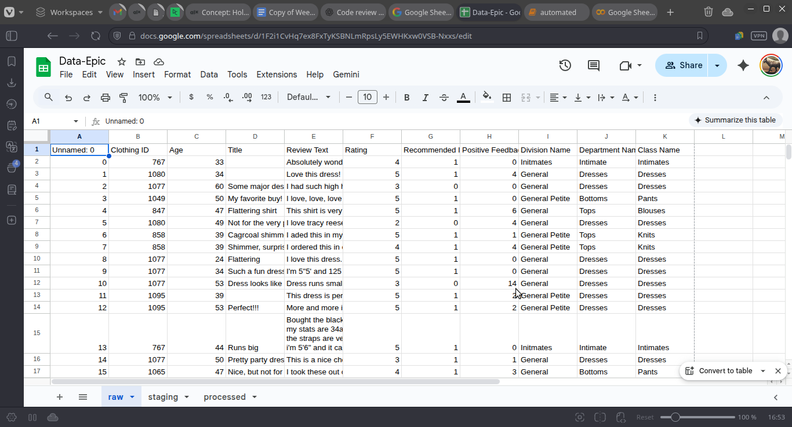
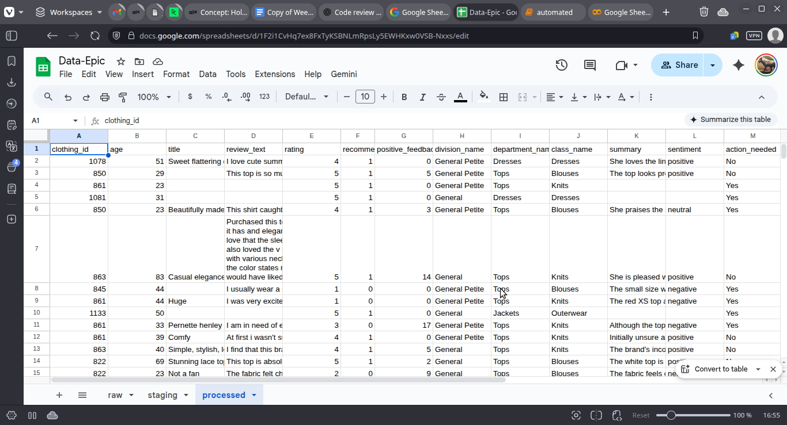

# Customer Review Summarization & Sentiment Analysis Pipeline

## 1. Introduction

This project implements an **end-to-end pipeline** for summarizing and analyzing customer reviews from an e-commerce platform focused on women's clothing. The primary objectives are:

* Automatically generate **concise, one-sentence summaries** for each review.
* Assign a **sentiment label** (`positive`, `negative`, or `neutral`) to every review.
* Identify reviews that require **action** (e.g., negative sentiment).
* Enable **idempotent updates** to Google Sheets, ensuring data integrity and repeatable runs.

The pipeline combines **data cleaning, batch processing, and API-driven summarization** using Groq AI models with Google Sheets integration for easy data storage and reporting.

---

## 2. Dataset Overview

The dataset consists of customer reviews collected from an e-commerce store for **women’s clothing products**. Key attributes include:

| Column            | Description                                 |
| ----------------- | ------------------------------------------- |
| `clothing_id`     | ID of product                               |
| `age`             | Age of buyer                                |
| `title`           | Review title                                |
| `review_text`     | Full review content                         |
| `rating`          | Customer rating                             |
| `recommended_ind` | Recommendation index                        |
| `pos_feedback`    | Positive feedback                           |
| `division_name`   | Product division                            |
| `department_name` | Department within the store                 |
| `class_name`      | Product category (e.g., Dresses, Intimates) |


* The dataset is stored as a CSV file: `data/reviews.csv`.
* For demonstration, the pipeline processes **200 reviews per run**.

---

## 3. Project Structure

```
project_root/
│
├── data/
│   └── reviews.csv           # Raw input CSV file
│
├── src/
│   ├── analysis.py           # runs analysis
│   ├── utils.py              # Helper functions (hashing, batching, Google Sheets)
│   └── etl.py                # running etl
│   └── viz.py                # Visualization

│
├── tests/
│   └── test_analysis.py      # Unit & async tests for pipeline functions
│   └── test_utils.py      # Unit & async tests for pipeline functions
│   └── test_etl.py      # Unit & async tests for pipeline functions
│
├── screenshots/
│   ├── raw_data.png          # Raw data sheet screenshot
│   └── processed.png    # Processed sheet screenshot
│
└── README.md                 
└── main.py                 
└── .gitignore                 


```

**Responsibilities:**

* `etl.py`: Loads raw data, cleans it, and performs summarization and sentiment classification.
* `utils.py`: Provides reusable functions for data validation, batching, hashing, and Google Sheets integration.
* `tests/`: Contains unit and async tests to ensure correct functionality.

---

## 4. Before/After Screenshots

### Raw Data Sheet (Before Pipeline)



### Processed Sheet (After Pipeline)



**Key additions in processed sheet:**

* `summary`: One-sentence review summary.
* `sentiment`: Classified sentiment.
* `action_needed`: Flag for negative reviews.

---

## 5. Analysis Summary

**Sentiment Distribution Report:**

| Sentiment | Count | Percentage |
| --------- | ----- | ---------- |
| Positive  | 112   | 58.64%     |
| Neutral   | 27    | 14.14%     |
| Negative  | 52    | 27.23%     |

**Key Insights:**

* Majority of reviews are positive, suggesting high customer satisfaction.
* Around 14% of reviews are negative, flagged for immediate action.
* Neutral reviews often lack sufficient context to classify sentiment confidently.
* Summarization reduces long-form reviews into concise insights for faster decision-making.

---

## 6. Reproducibility Steps

Follow these steps to run the pipeline end-to-end:

### 1. Clone Repository

```bash
git clone https://github.com/your-username/repo-name.git
cd repo-name
```

### 2. Install Dependencies

```bash
uv sync
```

### 3. Configure Environment

Add your Groq API key to `.env` :

```
GROQ_API_KEY=your_api_key_here
```

* Ensure `service-account-key.json` exists for Google Sheets access.

### 4. Prepare Dataset

* Place `reviews.csv` inside the `data/` folder.
* Ensure the CSV contains the required columns (`review_text`, `title`, etc.).

### 5. Run Pipeline

#### Synchronous Run

```bash
uv run main.py
```


### 6. View Results

* Processed sheet is saved in Google Sheets under `processed`.
* Columns `summary`, `sentiment`, and `action_needed` are automatically added.

### 7. Run Tests

```bash
uv run -m pytest 
```

All tests (unit and async) should pass, ensuring pipeline correctness.


